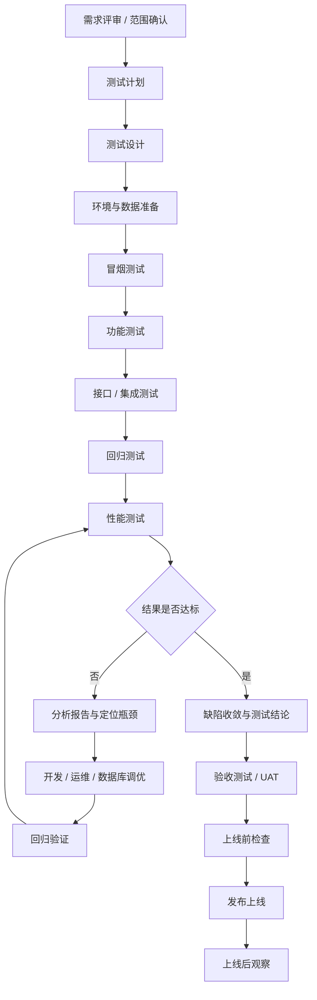
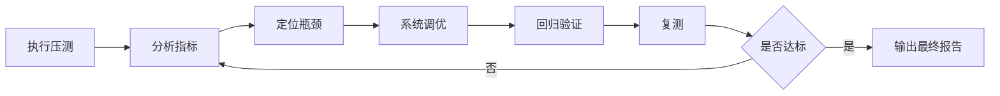

# 测试流程图

本文档用于说明项目从需求进入测试，到上线后观察的完整测试流程，适合作为团队测试执行总览。

## 1. 总体流程图

## 2. 压力测试后的处理闭环

压力测试结束后，通常不会直接结束测试，而是进入下面这个闭环：

重点关注指标：

- 成功率 / 错误率
- 响应时间 `p95`、`p99`
- 吞吐量 `QPS` / `TPS`
- CPU、内存、磁盘、网络
- 数据库连接数、慢 SQL、锁等待
- 应用线程池、缓存、消息队列、GC

## 3. 本项目建议落地顺序

结合当前仓库已有资产，建议测试执行顺序如下：

1. 先维护测试用例文档，例如 `docs/login-test-cases.md`、`docs/checkout-test-cases.md`。
2. 再执行 `frontend/tests/*.spec.ts` 中的自动化冒烟、功能和主流程测试。
3. 缺陷统一沉淀到 `docs/bug-report.md`。
4. 功能稳定后再执行 `k6` 性能测试，并将结果记录到 `docs/performance-test-records/`。
5. 当性能不达标时，回到“分析 -> 调优 -> 回归 -> 复测”闭环。

## 4. 阶段通过标准

建议按下面的判断逻辑推进：

- 冒烟不通过：停止后续测试，先修阻塞问题。
- 功能测试不通过：不进入性能测试。
- 主流程回归不稳定：不输出验收结论。
- 压测未达标：不直接判定可上线，必须复测。
- 验收未通过：不进入正式发布。

## 5. 相关文档

- 阶段说明文档：`docs/test-stage-description.md`
- 缺陷汇总：`docs/bug-report.md`
- 压测记录：`docs/performance-test-records/2026-04-27-k6-baseline-process.md`
